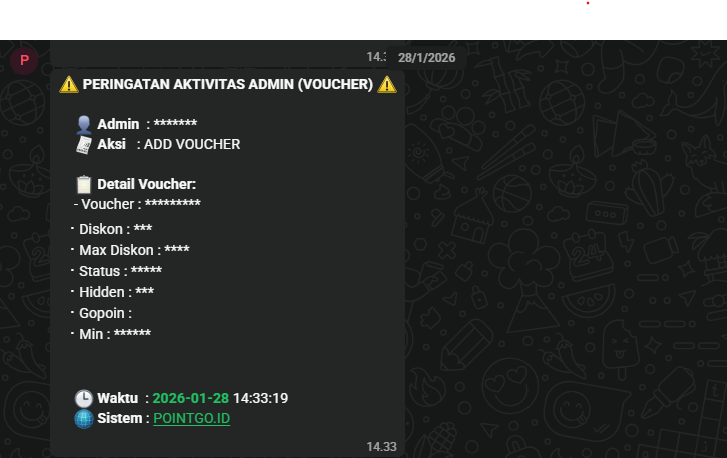
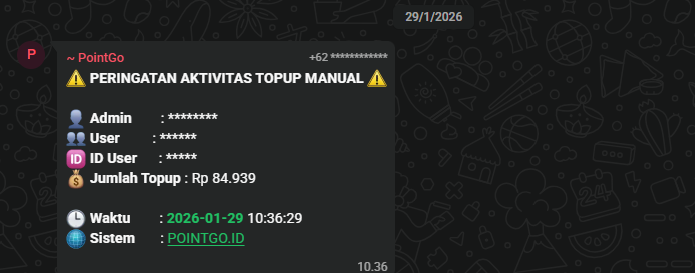
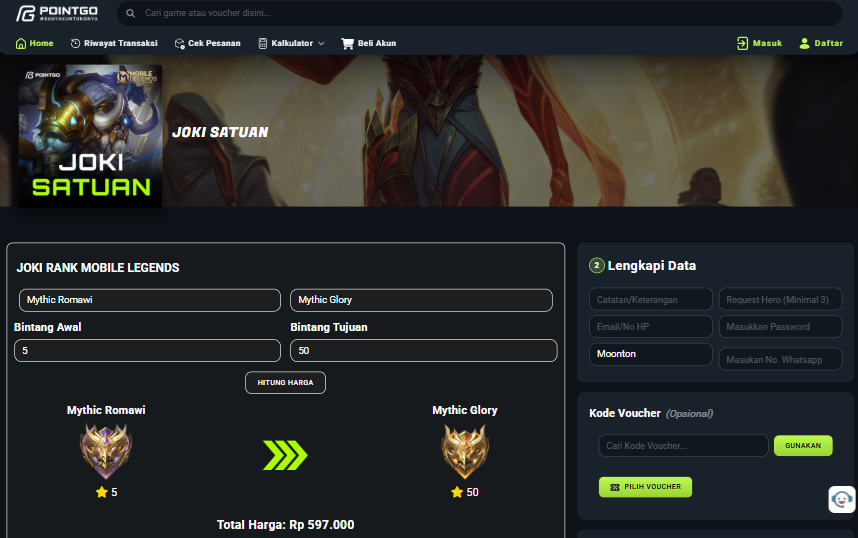
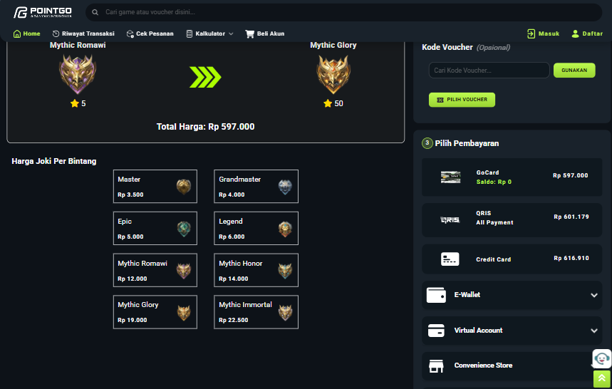
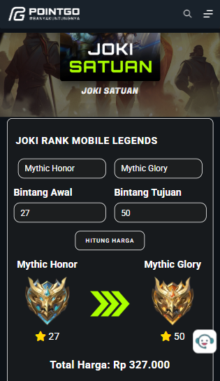
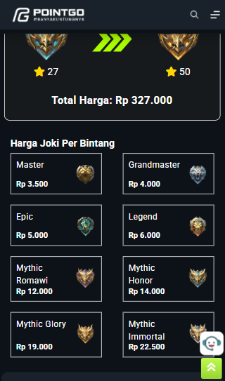
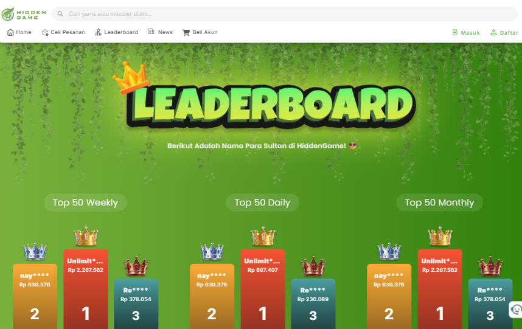
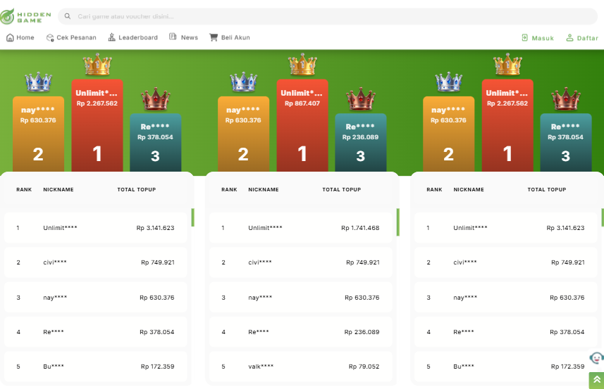
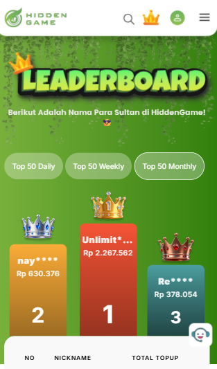
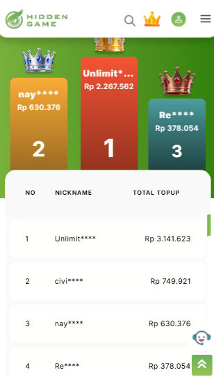

# Safii Maarif

Fullstack Developer with experience building web applications, business process automation, transaction systems, monitoring platforms, and internal operational tools using PHP, CodeIgniter, MySQL, JavaScript, and REST API integrations.

## Contact

📧 Email: safiimaarif2112@gmail.com

💼 LinkedIn: https://www.linkedin.com/in/safi-i-ma-arif-3511ab276/

💻 GitHub: https://github.com/Labiii2112

---

# Professional Experience

## Hidden Game
**Fullstack Developer**  
Duration: 1 Year 9 Months

Developed customer-facing features, transaction systems, leaderboard functionality, and administrative monitoring tools.

## PointGo
**Fullstack Developer**  
Duration: 2 Years

Built internal systems, business logic modules, monitoring solutions, and dynamic ordering workflows.

---

# Featured Projects

## 1. Admin Activity Monitoring & Audit Notification System

**Company:** PointGo

**Tech Stack:** PHP, CodeIgniter 4, MySQL, JavaScript, Fonnte API

Internal monitoring system that tracks administrative activities and automatically sends WhatsApp notifications when critical changes occur.

### Key Features

- Audit trail logging
- Change tracking (old value → new value)
- WhatsApp notification integration
- Product modification monitoring
- Voucher activity monitoring
- API key change monitoring
- User management activity monitoring

### Screenshots

---

## 2. Mobile Legends Rank Boost Calculator

**Company:** PointGo

**Tech Stack:** PHP, CodeIgniter 4, MySQL, JavaScript, Bootstrap

Dynamic rank boosting system that automatically calculates service prices based on rank tiers and star progression.

### Key Features

- Dynamic pricing calculation
- Rank-to-rank order generation
- Flexible star calculation
- Admin configurable pricing
- Integration with existing ordering system
- Real-time price transparency

### Screenshots

---

## 3. Top Up Leaderboard System

**Company:** Hidden Game

**Tech Stack:** PHP, CodeIgniter 4, MySQL, JavaScript, Bootstrap

Leaderboard platform that ranks users based on accumulated top-up transactions.

### Key Features

- Daily leaderboard
- Weekly leaderboard
- Monthly leaderboard
- Cron-based refresh system
- Top 50 ranking display
- User data filtering
- High-volume transaction aggregation

### Screenshots

---

## 4. Vehicle Automation System

**Role:** Freelance Programmer

**Tech Stack:** PHP, CodeIgniter 4, MySQL, JavaScript, Bootstrap

Vehicle registration and monitoring system designed for mining operational environments.

### Key Features

- Vehicle registration
- QR Code scanner integration
- Monitoring dashboard
- Reporting system
- Safety validation workflow

### Project Status

Functional prototype completed. Development was discontinued after the client stopped the project.

---

# Additional Projects

- Nutech Test API (Node.js, Express, MySQL, JWT)
- Inventory App
- Movie App

Repositories are available on my GitHub profile.

---

# Core Skills

### Backend

- PHP
- CodeIgniter 4
- Node.js
- Express.js
- REST API

### Database

- MySQL
- Query Optimization
- Data Aggregation

### Frontend

- JavaScript
- Bootstrap
- HTML
- CSS

### Integrations

- WhatsApp Gateway (Fonnte)
- QR Code Scanner
- Third-party APIs
- Cron Jobs
